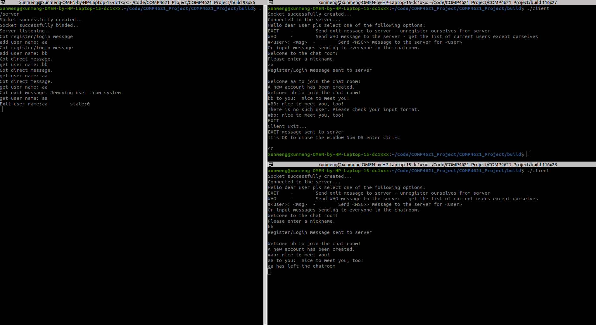
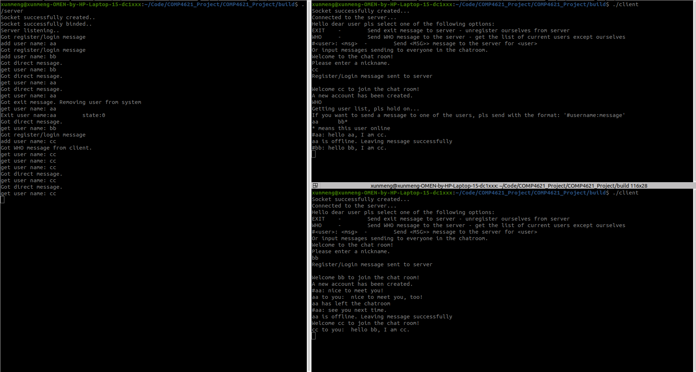
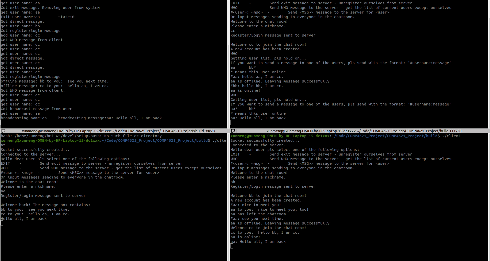
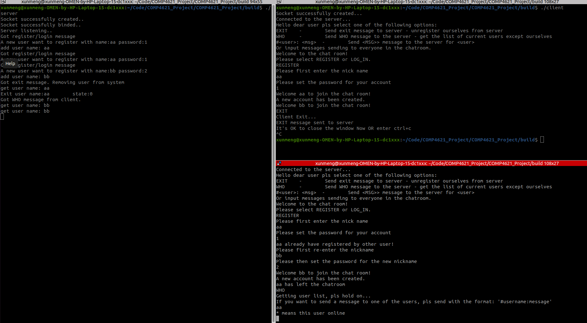
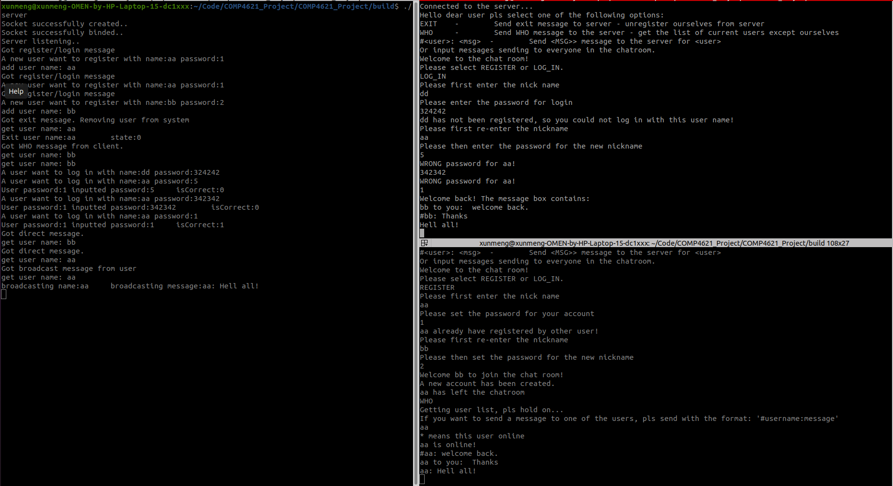

# **COMP4621 Project Report (Multiparty Chatroom)**

ZHAO Yu Xuan (20497819)

GitHub Repo: [Access Link](https://github.com/Xunmenggod/COMP4621_Project)

Complete Functionality Demo: [Video Link](https://www.youtube.com/watch?v=-yo-UJ9H3Z0)
## **Introduction**
In this project, I am required to implement a server-based multiparty chatroom to enable the concurrent communication among different users via network. During the course, we have learnt several ways to achieve the concurrent communication for multiple clients. It could be concluded with two categories which are thread/process creation in the server side to handle different users and synchronous I/O multiplexing by using `poll()`, `select()`, and the like. Each method has their own pros and cons, selection should be determined according to the restriction and purpose of the development. For this project, we are mandated to use the `poll()` function to handle multiple concurrent clients.

## **Task and Implementation**
The project tasks are well define in the [grading scheme](https://canvas.ust.hk/courses/47929/assignments/265627). They are divided into different function blocks with their own **command**, such as REGISTER, EXIT, WHO, #<user_name>:, and so on. I will follow the cases in grading scheme and introduce my own implementation for each part.
- **Register/Login**

In this part, the server need to firstly judge whether the user name given by the client is in the `listOfUsers`. If no, it means that this is a new user for registration. Then this user information will be appropriatedly constructed and added into the `listOfUsers`. Moreover, the newly created user socket will be added to the `pfds` for further concurrent communication. And the server will broadcast the welcome message  for the new user by the customized function `broadcast_online()`. To write the definition of the function, I created a **target enum** to differentiate the `ALL` and `OTHERS`. `ALL` means the message will be broadcasted to all the online users and `OTHERS` indicates that the client requesting the broadcasting will not recieve the message. For the case of registration, the target parameter is set to be `ALL`. Afterwards, the newly registered user will be assigned to a offline message box which is represented by a txt file with the name of **\<user name>.txt**. The txt file is simply created by `fopen()` with the "w" access. This message box will store all the offline message sent from other users line by line.

If the user name existed in `listOfUsers`, this is the case for login. The most important thing is to update the **state** and the **sockfd** of the existing user. The logged user will recieve all the offline messages which is retrived from his own txt file. The message retrival is done by `fopen()` with "r" access and `fgets()`. After that, a newly created temporary file is created and renamed to the name of the message box after removing the original message box. This is an easy and efficient way to clean the message box. Then the server will also broadcast the  message indicating the logged user is online to all other online users by calling `broadcast_online()` with the target `OTHERS`.

- **Direct Message**

If the client want to send a direct message to a specific user, the format will be **#\<user name>:\<message>**. Once the server recieved a message with the symbol `#`, it will recognize this message as direct message and execute the follwing steps to finish this task. Firstly, the server will check whether the target user name is in the `listOfUsers` by function `isNewUser()`. This function will traverse all the existing user in the `listOfUsers` and check if there is a user that has the same user name with the parameter `name`. If the user is not in the list, it means the user is not existed and the server will sent the message indicating there is no such user to the sending user. Otherwise, the target user exists and the server will further check whether the target user is `ONLINE` or `OFFLINE`. For the online case, the server will directly send the formatted message to the corresponding `sockfd` of the target user. In the other case, the formatted message will be appended to the txt file of the target user by function `fopen()` with "a" access, `fseek()`, and `fprintf()`. An extra message that indicates the message is successfully left to the offline target user will be sent to the sending client by the server.

-  **EXIT**

If a client type the EXIT command, the server will change the state of this user to be `OFFLINE`. Moreover a message that indicates a user left the chatroom will be broadcasted to other online users by `broadcast_online()` with target `OTHERS`. And the corresponding pollfd of the user will be closed and deleted from the `pfds`. The user could press ctrl+c to terminate its client program after seeing the indication in the client terminal window.

- **WHO**

The `WHO` command is straightforward to implement. First step is to construct a empty string messge to the requesting client which it is called `ToClient`. Next, the server will traverse all the existing users except the requesting user in the `listOfUsers`. If the traversed user is online, the user name with symbol `*` will be concatenated to the end of `ToClient`. If it is offline, only the user name will be concatenated to the end of `ToClient`. After each traverse, a tab symbol `\t` is added for `ToClient` to seperate each user. After all existing user's traversation, an extra line showing the meaning of symbol `*` is appended to `ToClient`. Last, the server will send the message `ToClient` to the requesting user.

- **Broadcast**

A message that did not match any command above is regarded as broadcast request by the server. Then the server will format the message to add the information of user name of the sending client. Afterwards, the formatted message will be broadcasted by calling the customized function `broadcast()`. Please notice that this `broadcast()` function is different with the one `broadcast_online()` because this broadcast() function will take care of the offline users which means the formatted message will also be left to the message box of the offline users.

- **Other Compulsory Requirements**

Firstly the client and server is connected by the TCP socket. For the server, its address is binded to the `INADDR_ANY` which means the server will listen to all the request from any ip address of the local host. And the client connects the server by using the loopback address which is `127.0.0.1`. Moreover, the server use the `setsockopt` function with `SO_REUSEADDR` parameter to enable the port reuse. This step could simplify the debug and test procedures. Server also uses the poll() function to achieve the synchronous I/O multiplexing for the concurrent communication with mult-clients. Since we do not want to block the recieving procedure for the clients while sending request to the server, a while loop function to recieve the message from server for all time is constructed as the recieving thread's task. Based on that, the recieving thread could be created by using the function `pthread_create()`. After the client exits, the client will change the variable `needClose` to be one. Then the recieving thread of the client will spontaneously exit by calling `pthread_exit()`.

## **Results**
I followed the procudures from the [project demo](https://canvas.ust.hk/media_objects_iframe/m-3rSgvzMQFTqLwx3g8skD7B8A6iKrBKWn?type=video?type=video), and my implementation of the project gives the same responses. I will demonstrate and explain my result by some screenshots. The [picture](#pic1) below shows the interaction result untill the user aa exited. Left terminal window runs the server process, right top is the client process for aa, and the right bottom is the client process for bb. From the screenshot, we could obeserve that commands for registering new user, direct message, and exit with online broadcasting perform well.

 

The second [figure](#pic2) illustrates the result for the demo procudure right before re-login for user aa. Followed the first picture, the user bb successfully left an offline message to aa. After that, a new user cc is created. User cc used the `WHO` command to check the user list, and cc successfully recieved a message that showed aa is offline and bb is online. Then cc sent two direct messages to aa and bb for greeting. These two direct messages also validated the correct implementation for direct message to offline and online users.

The last [screenshot](#pic3) shows the interaction outcome after aa rejoined the chatroom. I would like to clarify that the left bottom is the client process for aa, and the right top runs the client process for cc. Once the user aa login to the chatroom, the offline messages are sent to to aa from his txt file of the offline message box. And other online users recieved the broadcasting which indicates aa is online. Then the user cc recheck the user list by typing `WHO` command and gives the result that aa and bb both are online now. Lastly, aa send a broadcast by simply typing `Hello all, I am back`. Then bb and cc successfully recieved the broadcast message from aa.

## **Bonus**
- **Password**

In order to enable the password protection for each user, I added a command for `LOG_IN` to differentiate with the REGISTER. For the registered part, user is required to input a unregistered nickname and a password. If the register message including nickname and the password does not pass the check from the server which means the nickname has already existed in the `listOfUsers`, the server will simply send back the message to notify the client. Then the user will be asked to redo the previous procedure until the server send back the welcome message. The follwing [picture](#register) shows the result of my implementation for **REGISTER**.

 

For log in proceduer, the message also has to pass the check from the server. But the check contains two criteria which are the user name should be registered in the `listOfUsers` and the correct password respectively. If the message from the client does not pass the first criterion, the server will notify the situation and require another set of the user name and password. Regarding with the second case, the server will tell the client that the provided password is not match with the maintained list in server side. Moreover, the client still need to re-enter the password for the user name. The [figure](#login) illustrates the same logic for the **LOG_IN** procedure.

- **GUI**

***Not Implemented***

- **Interruption or Restart Handling**

***Not Implemented***

## **Future Work**
In viewing of the whole development for this project, I am quite satisfied with the current result. However there are still some other tasks or work that could be done for optimization and achieving other functionalities. Firstly, the other two items for bonus could be implemented latter. What's more, the data structure for user list maintained by the server could be changed to hash table that could make the name searching run in O(1) time. Furthermoer, the user password could be also assigned to the user's specific offline message box (`txt file`) to restrict the file access. Last but not least, the encryption of the user password during the communication is a crucial task for user account security.